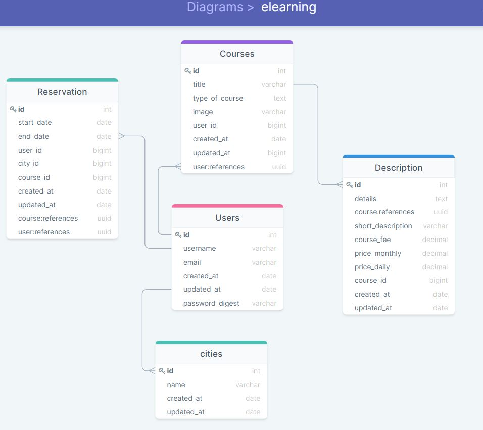

# e-learning platform FRONTEND


E-learning app is a learning institution app which serves as the first contact between the student who is willing to enrol for
a course and the school. The project is 99% done and some of the functionalities are finalized in the backend & front end, Which can be checked out.....

## Entity Relationship diagram


## Demo Link
[Click here to see live demo](https://e-learning-platform-p.netlify.app/)

## Link to the back end
[Click here to see the back end](https://github.com/OLIPLICHE/e-learning-platform)


## The learning objective of this project are
- Create react front end app
- Connect react front end app to rails back end
- Use API end point to get data
- Fetch data from the API

## Built With

- React
- Redux
- Materia UI
- Git

## Getting Started

To get a local copy up and running follow these simple example steps.


### Setup
- ```git@github.com:OLIPLICHE/e-learning-platform-frontend.git```

- ```cd e-learning-platform-frontend```

### Running The App

- Run ```npm install``` to install all the necessary gems
- Make sure to run our [Rails backend](https://e-learning-back.herokuapp.com/) application first before running the React app so that it takes up the `port 3000` for the API to work.

- Once the back end is runing on `port 3000` then start the react app and you will be prompted to run the server on another port like `port 3001`.

## Authors

👤 **Yannick-Noel Aka**

- GitHub: [@codecaiine](https://github.com/codecaiine/)
- LinkedIn: [Yannick-Noel AKA](https://www.linkedin.com/in/yannick-no%C3%ABl-aka/)

👤 **Mavoungou Paka**

- GitHub: [@OLIPLICHE](https://github.com/OLIPLICHE)
- LinkedIn: [Mavoungou Paka](https://www.linkedin.com/in/olipliche/)

## 🤝 Contributing

Contributions, issues, and feature requests are welcome!

Feel free to check the [issues page](https://github.com/OLIPLICHE/e-learning-platform/issues).

## Show your support

Give a ⭐️ if you like this project!

## Acknowledgments

- Microverse
